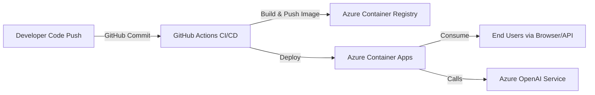

# 🚀 MLOps CI/CD for Generative AI on Azure

## 📌 Objective
The goal of this project is to build an **end-to-end CI/CD pipeline** for deploying a Generative AI application on **Azure** using modern DevOps and MLOps best practices.  
This ensures that every code change, model update, or configuration improvement automatically goes from **development → build → containerization → deployment → monitoring**.

---

## 🔍 Introduction
In production AI systems, it’s not enough to train models — we must also:
- Automate deployment with **CI/CD pipelines**
- Use **cloud-native infrastructure** to scale
- Manage **secrets & credentials** securely
- Ensure smooth integration between **ML models, APIs, and container services**

This project demonstrates how to integrate **Azure ML**, **GitHub Actions**, **Azure Container Registry (ACR)**, and **Azure Container Apps** to achieve a fully automated pipeline for Generative AI.

---

## 🏗️ Architecture

